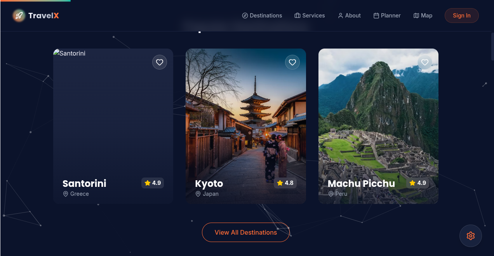

# TravelEx - Luxury Travel Experience Platform 🚀

TravelEx is a next-generation luxury travel booking platform designed to offer immersive and seamless travel planning experiences. Built with modern web technologies, it features a cinematic "Sunset Explorer" aesthetic, interactive particle effects, and deep personalization.



live Demo: https://travelx-gold.vercel.app

## 🌟 Key Features

*   **Cinematic Hero Section**: Immersive visuals with a reliable high-quality background and smooth call-to-action flows.
*   **Interactive Design**:
    *   **Particle Effects**: Custom "Constellation" particle background using `tsparticles` for a premium feel.
    *   **Animations**: Smooth page transitions and element reveals powered by `framer-motion`.
    *   **Glassmorphism**: Modern UI components with frosted glass effects.
*   **Comprehensive Booking Flow**:
    *   **Multi-step Booking**: A guided 4-step process (Destination -> Dates -> Services -> Details).
    *   **Smart Pre-fill**: "Book Now" buttons on destination pages pre-fill the booking engine with location and price data.
    *   **Visual Calendar**: Integrated `react-datepicker` for intuitive date selection.
    *   **Add-on Services**: Selectable luxury services like private transfers and insurance.
*   **Rich Content**:
    *   **Explore Page**: Filter destinations by continent, search by name, and now filter by **Price Range**.
    *   **Services & Support**: Detailed pages for service offerings, help center, insurance info, and cancellation policies.
    *   **Global Layout**: Consistent Navbar and Footer across all pages.
*   **Performance**: Optimized build with Vite, featuring code splitting and asset optimization.

## 🛠️ Technology Stack

*   **Framework**: [React](https://reactjs.org/) (v18)
*   **Build Tool**: [Vite](https://vitejs.dev/)
*   **Language**: [TypeScript](https://www.typescriptlang.org/)
*   **Styling**: [Tailwind CSS](https://tailwindcss.com/)
*   **Animations**: [Framer Motion](https://www.framer.com/motion/)
*   **Icons**: [Lucide React](https://lucide.dev/)
*   **Maps**: [React Leaflet](https://react-leaflet.js.org/)
*   **Particles**: [tsparticles](https://particles.js.org/)

## 🚀 Getting Started

### Prerequisites

*   Node.js (v16.0.0 or higher)
*   npm (v7.0.0 or higher)

### Installation

1.  **Clone the repository:**
    ```bash
    git clone https://github.com/mohakamran/travelex.git
    cd travelex
    ```

2.  **Install dependencies:**
    ```bash
    npm install
    ```

3.  **Run the development server:**
    ```bash
    npm run dev
    ```
    Open [http://localhost:5173](http://localhost:5173) to view it in your browser.

## 📦 Deployment Guide (GitHub Pages)

Follow these steps to deploy your site live to `mohakamran.github.io/travelx`.

### 1. Update `vite.config.ts`
Ensure your `vite.config.ts` includes the correct base path. for a user-site (`username.github.io`), the base is usually `/` or the repo name if it's a project site. Since you mentioned the URL `mohakamran.github.io/travelx`, we assume the repo name is `travelx` (or `travelex` per your request).

**If repo is `travelex`:**
```typescript
// vite.config.ts
export default defineConfig({
  plugins: [react()],
  base: "/travelex/", // <--- IMPORTANT: Must match your repo name!
})
```

### 2. Push Code to GitHub
```bash
# Initialize git if you haven't
git init

# Add all files
git add .

# Commit
git commit -m "Initial commit"

# Link to your remote repo (replace with your actual URL)
git remote add origin https://github.com/mohakamran/travelex.git

# Push to main
git push -u origin main
```

### 3. Deploy
We will use the `gh-pages` package to handle deployment easily.

1.  **Install gh-pages:**
    ```bash
    npm install gh-pages --save-dev
    ```

2.  **Update `package.json` scripts:**
    Add `predeploy` and `deploy` scripts:
    ```json
    "scripts": {
      "dev": "vite",
      "build": "tsc && vite build",
      "preview": "vite preview",
      "predeploy": "npm run build",
      "deploy": "gh-pages -d dist"
    }
    ```

3.  **Run the deployment:**
    ```bash
    npm run deploy
    ```

4.  **Configure GitHub Settings:**
    *   Go to your GitHub Repository -> **Settings** -> **Pages**.
    *   Under **Source**, ensure "Deploy from a branch" is selected.
    *   The branch should be `gh-pages` (created automatically by the command above).
    *   Your site will be live at `https://mohakamran.github.io/travelex/` shortly 🚀

## 📄 License
This project is licensed under the MIT License - see the LICENSE file for details.
